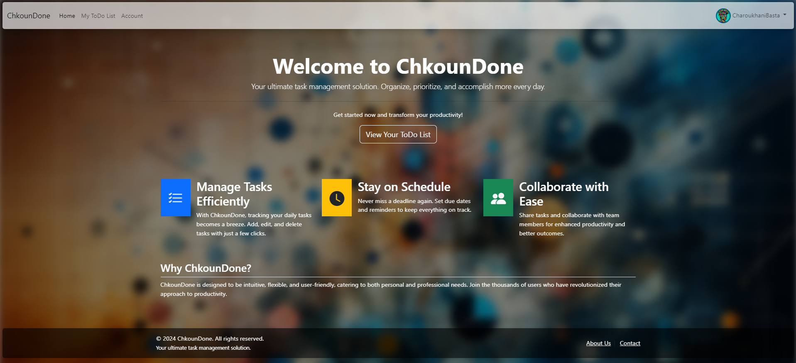

# ChkounDone: Flask ToDo List App

ChkounDone is a comprehensive task management solution designed to help users organize, prioritize, and accomplish tasks more efficiently. Built with Flask, this web application offers a robust platform for personal productivity enhancement.


## Features

- User authentication system for personalized task management
- Create, modify, and delete tasks with ease
- Organize tasks with categories, priorities, and deadlines
- Responsive design for mobile and desktop devices

## Technologies

- Flask
- Flask-Login for user authentication
- SQLAlchemy for database management
- Bootstrap 5 and Bootstrap Icons for frontend design
- jQuery for frontend interactions

## Setup

To run this project locally, follow these steps:

1. Clone the repository:

```bash
git clone https://github.com/mdakk072/ChkounDone.git
```

2. Install dependencies:

```bash
pip install -r requirements.txt
```


4. Run the Flask application:

```bash
python app.py
```

Your application should now be running on `http://127.0.0.1:5000/`.


